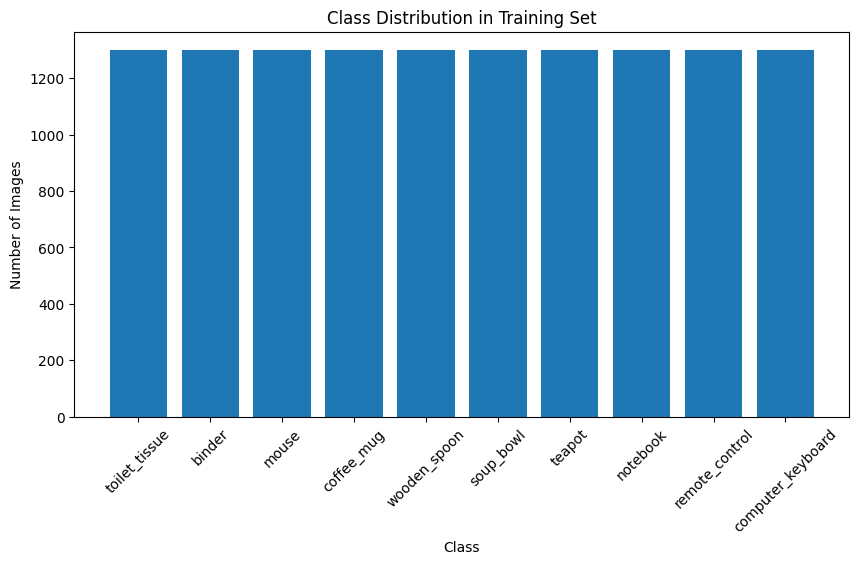
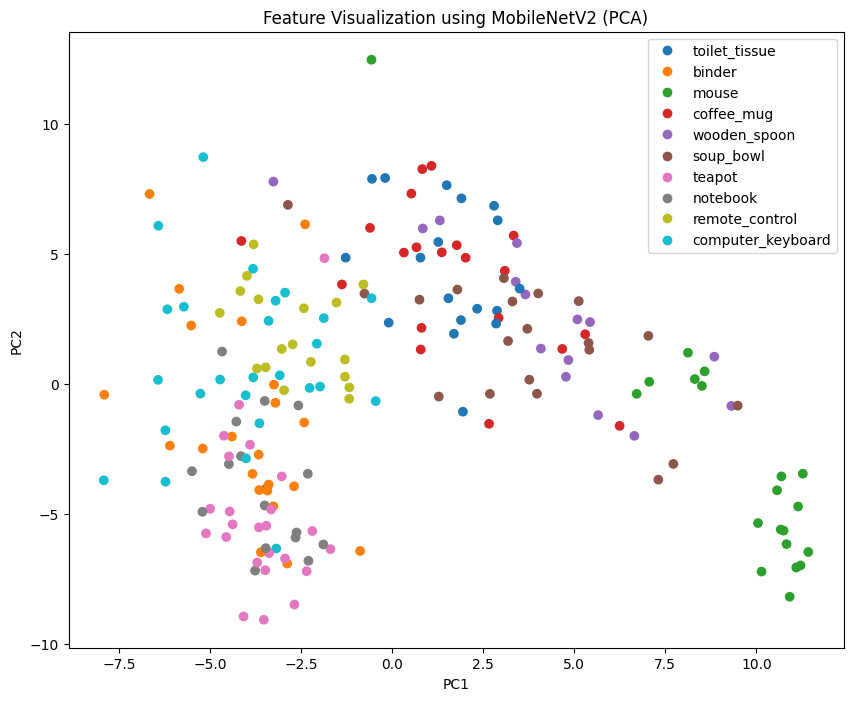
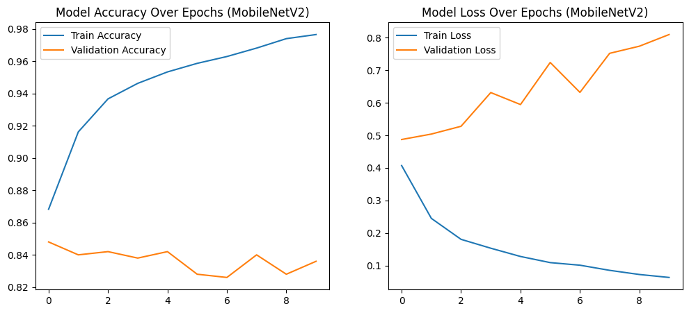
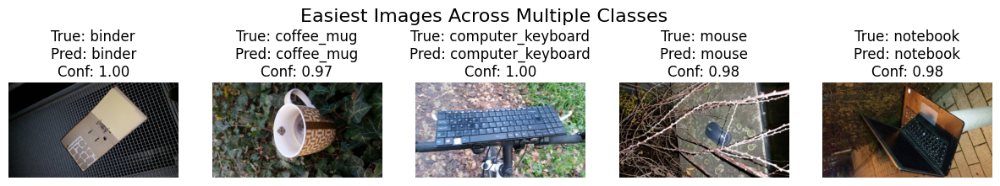
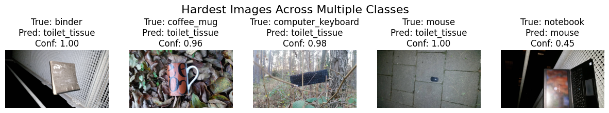
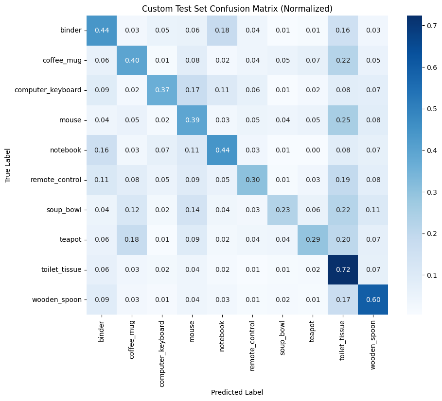
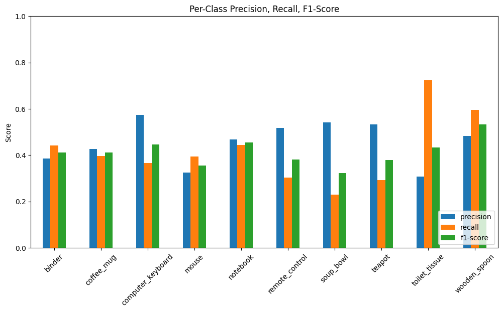

# xAI Project: Explainable AI & Model Diagnostics

This repository hosts a comprehensive **Computer Vision** project built on **TensorFlow**, focused on both **model performance** and **Explainable AI (xAI)** analysis.
Rather than stopping at accuracy, this project investigates **how**, **where**, and **why** a model succeeds or fails — especially when transitioning from controlled datasets to real-world images.

---

## 🚀 1. Project Philosophy: Transparency in AI

Modern deep learning models often behave like **black boxes**. This project aims to make model behavior **interpretable, auditable, and trustworthy** by answering three core questions:

* **What did the model learn?**
  Feature visualization using **PCA (Principal Component Analysis)**

* **Where did the model focus?**
  Visual attention analysis using **Grad-CAM**

* **Why did the model fail?**
  Error analysis via **calibration curves**, **confusion matrices**, and **class difficulty inspection**

---

## 🏗️ 2. Technical Pipeline

### A. Dataset & Augmentation (ImageNet-1K Subset)

We used a curated subset of **ImageNet-1K**, consisting of **10 object classes**, including:

* Remote Control
* Mouse
* Keyboard
* Wooden Spoon
* Coffee Mug
* *(and additional everyday object classes)*

**Dataset Scale**

* Training Images: ~13,000
* Test Images: ~500

**Image Source**

* ImageNet-1K
* 📎 **Dataset Download Link:** *[[dataset link here]](https://vc.uni-bamberg.de/mod/resource/view.php?id=2076765)*

**Data Augmentation Techniques**
To improve generalization and reduce overfitting:

* Rotation
* Horizontal flipping
* Zoom
* Brightness adjustment
* **Resizing to 224×224 (required for MobileNetV2)**

> ⚠️ **Note:** Image resizing is a critical preprocessing step because **MobileNetV2 requires a fixed input shape of 224×224**.

**📊 Class Distribution**





---

### B. Three-Tier Evaluation Strategy

We evaluated model robustness across **three increasingly realistic stages**:

1. **Validation Performance**

   * Standard evaluation during training
   * Accuracy stabilized at ~84%

2. **Subset Test Performance**

   * Tested on unseen ImageNet-1K folders
   * Minor performance degradation

3. **Reality Check (Custom Real-World Images)**

   * Independent images captured in real environments

**Result**

* Accuracy dropped to **41.8%**
* Performance loss: **~42%**

**Key Insight**
This highlights the **Reality Gap** — models trained on clean datasets struggle when exposed to **real-world noise, cluttered backgrounds, and lighting variations**.

---

### C. Architecture Benchmark

| Model       | Architecture      | Accuracy | Conclusion                      |
| ----------- | ----------------- | -------- | ------------------------------- |
| MobileNetV2 | Lightweight CNN   | ~84%     | Stable and efficient            |
| ResNet50    | Deep Residual CNN | ~30%     | Overfitting; failed to converge |

**Why MobileNetV2?**

* Better suited for limited data
* Faster convergence
* More stable training behavior

---

## 🔍 3. Explainable AI (xAI) Analysis Suite

---

### 3.1 Feature Visualization using PCA

We applied **Principal Component Analysis (PCA)** to intermediate feature embeddings extracted from the model.

**Why PCA?**

* Reduces high-dimensional features to 2D/3D
* Reveals **class separability**
* Shows how well the model clusters similar objects

**What it shows**

* Overlapping clusters → class confusion
* Compact clusters → strong feature learning




---

### 3.2 Training Performance (10 Epochs)

We trained MobileNetV2 for **10 epochs** and tracked:

* Training Accuracy vs Validation Accuracy
* Training Loss vs Validation Loss

**Why this matters**

* Detects **overfitting** or **underfitting**
* Shows training stability and convergence



---

### 3.3 Hardest & Easiest Class Analysis

We identified:

* **Easiest class:** Highest accuracy & lowest confusion
* **Hardest class:** Lowest accuracy & highest misclassification

**Why analyze this?**

* Reveals class ambiguity
* Highlights dataset imbalance or visual similarity
* Guides targeted data collection or augmentation






---

### 3.4 Grad-CAM: Attention & Context Bias

Grad-CAM heatmaps were used to visualize **where the model looks** when making predictions.

**Key Discovery**

* The model often focused on **background textures** (wood grain, table patterns)
* Ignored the actual object (e.g., Remote Control)

**Impact**

* Major contributor to poor real-world performance
* Indicates **context bias**

```
[Image Placeholder – Grad-CAM Heatmaps]
```

---

### 3.5 Model Calibration Curve

We analyzed how **confident** the model is compared to how **accurate** it actually is.

**What is calibration?**

* A well-calibrated model’s confidence matches its correctness
* Overconfident models fail silently

**Observed Issue**

* Incorrect predictions made with **96–100% confidence**

```
[Image Placeholder – Model Calibration Curve]
```

---

### 3.6 Confusion Matrix (MobileNetV2 – 10 Classes)

A confusion matrix shows:

* True labels vs predicted labels
* Which classes are commonly confused

**Why it matters**

* Pinpoints systematic misclassification
* Reveals visually similar classes (e.g., Keyboard vs Mouse)




---

### 3.7 Precision, Recall & F1-Score (Bar Chart)

We computed **Precision, Recall, and F1-Score** for all 10 classes.

**Metric Meaning**

* **Precision:** How many predicted positives are correct
* **Recall:** How many actual positives were detected
* **F1-Score:** Balance between precision and recall

**Why this is important**

* Accuracy alone can be misleading
* Class-wise metrics expose hidden weaknesses



---

## 🛠️ 4. Getting Started

**Clone the Repository**

```bash
git clone https://github.com/Synaptic-Sparks/synaptic-sparks-code.git
```

**Run the Notebook**

* Open `xAI_Proj.ipynb` in **Google Colab**
* Dataset downloads automatically using `gdown`

---

## 📬 5. Contact Information

* **Zeeshan Ahmed**
* Role: Lead Developer / Model Architecture
* GitHub: [github.com/ZeeshanAhmed](https://github.com/Zeeshan6948)


* **Muhammad Uzair Janjua**
* Role: Data Engineer / xAI Specialist
* GitHub: [github.com/UzairJanjua](https://github.com/uzairjanjua1)


---
## ⚖️ 6. License

This project is licensed under the **MIT License**.

```
Copyright (c) 2026

Permission is hereby granted, free of charge, to any person obtaining a copy
of this software and associated documentation files (the "Software"), to deal
in the Software without restriction, including without limitation the rights
to use, copy, modify, merge, publish, distribute, sublicense, and/or sell
copies of the Software.
```

---